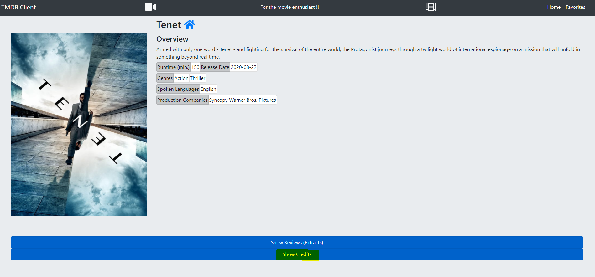

# Project - ReactJS app.

Name: Jessica McCabe

## Overview.
Additional Objectives of the Movie App

UI features:
–User interaction, e.g. filtering, menu selection.
–Dynamic behavior.
–Navigation -~3 views/pages

React features:
–Mix of statefull and stateless components.
–Unidirectional dataflow and Data-down-action up. 
–Routing –1 parameterized URL.
–Core hooks (useState/useEffect)
–Some Storybook implementation

Web API:
–2 endpoints

New/Modified Features
 
 + Show Credits Under Movie
 + Hide Credits Under Movie
 + Clickable Actor Name in Credits
 + Actor Biography Page
 + Show Movie Credits For Actor
 + Hide Movie Credits For Actor
 + Clickable Film Title in Movie Credits For Actor directing to that movie page
 + Updated Home Icon to direct to home page of this app

## Setup requirements.

Once you have imported the code to VS code, run $ npm install
You will need to acquire an API Key from https://www.themoviedb.org/signup
In VS Code, in the project base folder create a new file called .env with the following content:

REACT_APP_TMDB_KEY=.... your API key value ...

## API Data Model.

Additional TMDB endpoints used and sample responses, in JSON:

EndPoint:
`https://api.themoviedb.org/3/person/${id}?api_key=${process.env.REACT_APP_TMDB_KEY}`

Response:
{
birthday: "1964-04-24",
known_for_department: "Acting",
deathday: null,
id: 938,
name: "Djimon Hounsou",
also_known_as: [
"Djimon",
"Djimon Gaston Hounsou",
"Djimon Hounso",
"Djimon Housoun",
"Джимон Хонсу"
],
gender: 2,
biography: "A Beninese-American actor and model. As an actor, Hounsou has been nominated for two Academy Awards. Hounsou became a naturalized American citizen in 2007. He was reluctant to renounce his Beninese citizenship and therefore opted to become a dual citizen of both Benin and the United States, effectively rendering him a Beninese-American. Djimon Hounsou was born in Cotonou, Benin, in 1964, to lbertine and Pierre Hounsou. He immigrated to Lyon in France at the age of thirteen with his brother, Edmond. In 1987, he became a model and established a career in Paris. He moved to the U.S. in 1990. One year before obtaining his college degree, he dropped out of school. In the 1989 he appeared in a music video of Straight Up by Paula Abdul. Hounsou's film debut was in the 1990 Sandra Bernhard film Without You I’m Nothing, and he has had television parts on Beverly Hills, 90210 and ER and a guest starring role on Alias, but received a larger role in the science fiction film Stargate. His first on-screen appearance was in the 1990 Janet Jackson video “Love Will Never Do (Without You).” He also starred in a 2002 Gap commercial directed by Peter Lindbergh, dancing to a rendition of John Lee Hooker's "Boom Boom" by Arrested Development's Baba Oje. He received wide critical acclaim and a Golden Globe Award nomination for his role as Cinqué in the 1997 Steven Spielberg film Amistad. He gained further notice as Juba, in the 2000 film Gladiator. He was nominated for the Academy Award for Best Supporting Actor, for In America, in 2004, becoming the fourth African male to be nominated for an Oscar (along with Basil Rathbone, Cecil Kellaway and Omar Sharif). In 2006, he won the National Board of Review Award for Best Supporting Actor for his performance in Blood Diamond; he received Broadcast Film Critics Association, Screen Actors Guild Award, and Academy Award nominations for this performance. In 2007, Hounsou began dating model/CEO of Baby Phat, Kimora Lee Simmons. In 2008 Hounsou and Simmons visited Hounsou's family and while there, the two participated in a traditional commitment ceremony. On May 30, 2009, Simmons gave birth to their son, Kenzo Lee Hounsou, reportedly named because Kenzo means 3 (Kimora's third child). Hounsou is now a naturalized United States citizen and resides in Los Angeles.  ",
popularity: 4.814,
place_of_birth: "Cotonou, Benin",
profile_path: "/hco0KMbrxACYTmBfAkSzCf23CXV.jpg",
adult: false,
imdb_id: "nm0005023",
homepage: null
}

EndPoint:
`https://api.themoviedb.org/3/person/${id}/movie_credits?api_key=${process.env.REACT_APP_TMDB_KEY}`

Response:
{
cast: [
{
character: "Cinque",
credit_id: "52fe448e9251416c75038f4b",
release_date: "1997-12-03",
vote_count: 815,
video: false,
adult: false,
vote_average: 7,
title: "Amistad",
genre_ids: [
18,
36,
9648
],
original_language: "en",
original_title: "Amistad",
popularity: 3.263,
id: 11831,
backdrop_path: "/2lI5rNJeYHShg9okpEXSFzQZqWj.jpg",
overview: "In 1839, the slave ship Amistad set sail from Cuba to America. During the long trip, Cinque leads the slaves in an unprecedented uprising. They are then held prisoner in Connecticut, and their release becomes the subject of heated debate. Freed slave Theodore Joadson wants Cinque and the others exonerated and recruits property lawyer Roger Baldwin to help his case. Eventually, John Quincy Adams also becomes an ally.",
poster_path: "/zT5z9icgcXdaeHPgSHOjtrnPFa9.jpg"
},
{
character: "Narrator (U.S. Version)",
credit_id: "52fe4c44c3a36847f8225e6f",
release_date: "2000-09-09",
vote_count: 1,
video: false,
adult: false,
vote_average: 5,
title: "The Middle Passage",
genre_ids: [ ],
original_language: "fr",
original_title: "Passage du milieu",
popularity: 1.491,
id: 161407,
backdrop_path: null,
overview: "A realistic look at the horrors of the slave trade, told entirely through the voice of a dead African slave whose spirit haunts the ocean route",
poster_path: null
}
],
crew: [
{
id: 57585,
department: "Production",
original_language: "en",
original_title: "Elephant White",
job: "Producer",
overview: "An assassin is hired by a businessman to avenge the murder of his daughter by white slave traders in Thailand.",
vote_count: 133,
video: false,
poster_path: "/hqriJWWisRhm5XapyuB40D1jqqA.jpg",
backdrop_path: "/hj9WFLJyrtsgIrkMSiJCH729gi6.jpg",
title: "Elephant White",
popularity: 14.879,
genre_ids: [
28,
80,
14,
53
],
vote_average: 5,
adult: false,
release_date: "2011-05-17",
credit_id: "54e757fcc3a3685b000016e9"
}
],
id: 938
}

EndPoint:
`https://api.themoviedb.org/3/movie/${id}/credits?api_key=${process.env.REACT_APP_TMDB_KEY}`

Response:
{
id: 605116,
cast: [
{
cast_id: 8,
character: "Art",
credit_id: "5cec34a1c3a3685a161f83f7",
gender: 2,
id: 134,
name: "Jamie Foxx",
order: 0,
profile_path: "/hPwCMEq6jLAidsXAX5BfoYgIfg2.jpg"
},
{
cast_id: 7,
character: "Frank",
credit_id: "5cec34999251416983b94b26",
gender: 2,
id: 24045,
name: "Joseph Gordon-Levitt",
order: 1,
profile_path: "/dhv9f3AaozOjpvjAwVzOWlmmT2V.jpg"
}
]
}

#App Design.

### Component catalogue.

Stories relating to new/modified components 

### UI Design.
New/modified views

>Shows detailed information on a cast member. Clicking the 'Show Movie Credits' button will display movie credits from the cast member.

>Shows expanded view of the cast members movie credits.

>Button to Show the Credits of the movie.

>Expanded List of Credits with Clickable Name to navigate to the cast members details page.

### Routing.

Routes supported 

+ /reviews/form Add a review to a movie in your favourites
+ /reviews/:id View a review for a movie
+ /movies/favorites View the movies in your favourites
+ /movies/:id View a movies details
+ /cast/:id View an actors biograpy
+ / go to home page

## React feature set.

+ useState and useEffect hooks - src/components/movieCredits/index.js
+ useContext hook - src/components/buttons/addToFavourites.js
+ Extended Link - src/components/personCredits/index.js
+ Programmatic navigation - src/pages/castDetailsPage.js

## Independent learning.

LinkedIn Learning - React.js http://www.linkedin.com/learning/paths/become-a-react-developer?trk=flagship-lil_details_certification
>Button to Show the Credits of the movie.

Delpoy to Zeit - https://movies-app-seven.vercel.app/

